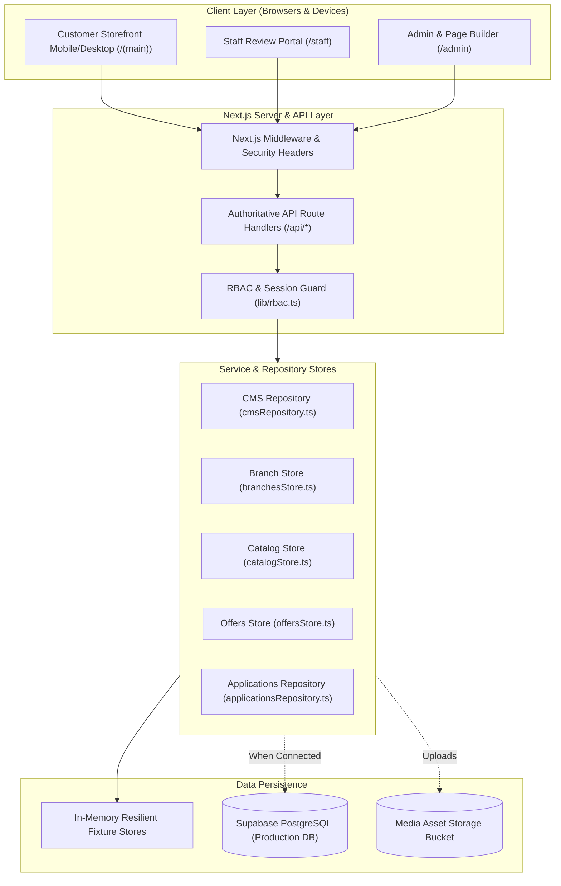

# MeePro System Architecture

> **Architecture Style:** Next.js 16 Unified Full-Stack Application (App Router)  
> **Documentation Target:** `/ai-docs/ARCHITECTURE.md`

---

## 1. High-Level System Architecture Diagram



---

## 2. Directory Structure Map

```text
meepro-app/
├── ai-docs/                         # Authoritative AI documentation layer
│   ├── BASELINE.md                  # Verification baseline & initial build state
│   ├── MASTER_SPEC.md               # Functional specifications & module inventory
│   ├── ARCHITECTURE.md              # System flow, diagrams, directory layout
│   ├── DATABASE.md                  # Database models, schemas, and ER diagrams
│   ├── BUSINESS_RULES.md            # Financing, pricing, and workflow logic
│   ├── PERMISSIONS.md               # RBAC matrix and security boundaries
│   ├── API_CONTRACTS.md             # Authoritative REST API contracts
│   ├── DESIGN_SYSTEM.md             # Color tokens, typography, and UI specs
│   ├── CURRENT_STATUS.md            # Active health & operational status
│   ├── TECHNICAL_DEBT.md            # Identified technical debt & improvements
│   ├── DEVELOPMENT_WORKFLOW.md      # Future branch & approval guidelines
│   └── CHANGELOG.md                 # Granular historical change log
├── public/                          # Static assets, brand logos, favicons
├── scripts/                         # Verification & utility scripts
│   ├── verify-scenarios.mjs         # §15 MeePro 12 E2E scenario validation suite
│   └── test-e2e.mjs                 # Automated headless integration tests
├── src/
│   ├── app/                         # Next.js 16 App Router
│   │   ├── (main)/                  # Public customer storefront layout & routes
│   │   │   ├── account/             # Customer profile, member tier, rewards
│   │   │   ├── apply/               # Multi-step financing application form
│   │   │   ├── branches/ & stores/  # Store locator & canonical detail pages
│   │   │   ├── products/            # Catalog browsing & PDP
│   │   │   ├── promotions/          # Current campaigns & discount offers
│   │   │   └── home/                # Dynamic modular homepage
│   │   ├── admin/                   # Administrative backoffice portal
│   │   │   ├── branches/            # Store branch CRUD management
│   │   │   ├── products/            # Product catalog CRUD & ordering
│   │   │   ├── offers/              # Installment & campaign pre-creation
│   │   │   ├── media/               # Media library with reference deletion protection
│   │   │   ├── page-builder/        # Visual CMS block editor with live preview
│   │   │   ├── roles/               # Staff permission management
│   │   │   └── system-config/       # Global toggles (Membership, MeePoints)
│   │   ├── staff/                   # Branch staff & manager portal
│   │   │   ├── applications/        # Underwriting queue & state machine
│   │   │   └── customer-lookup/     # ID / phone customer search
│   │   └── api/                     # REST API endpoints
│   │       ├── admin/               # Internal admin management APIs
│   │       ├── applications/        # Credit application submission & audit
│   │       ├── cms/                 # Pages, widgets, revisions, scheduling
│   │       ├── offers/              # 0% Installment offer endpoints
│   │       ├── products/            # Authoritative product catalog APIs
│   │       ├── staff/               # Staff auth, queue, notes, appointment APIs
│   │       └── stores/              # Public store location APIs
│   ├── components/                  # Reusable UI component modules
│   │   ├── branches/                # Branch cards, dialogs, map links
│   │   ├── cms/                     # VisualPageBuilder, WidgetRenderer
│   │   ├── home/                    # CustomerGreeting, BannerCarousel, etc.
│   │   ├── layout/                  # Navigation bar, mobile bottom bar, footer
│   │   └── ui/                      # Base buttons, inputs, modals, alerts
│   ├── features/                    # Domain-driven feature types and validators
│   │   ├── branches/                # Validation schemas, phone normalizers
│   │   └── catalog/                 # Product summary, variant, offer models
│   ├── lib/                         # Shared utilities, configs, clients
│   │   ├── adminSystem.ts           # SystemConfig store & global toggles
│   │   ├── cmsDb.ts                 # Page & widget database layer
│   │   ├── currency.ts              # Thai Baht formatting utilities
│   │   ├── rbac.ts                  # Role-based authorization guard
│   │   ├── supabase.ts              # Public client
│   │   ├── supabaseAdmin.ts         # Service-role admin client
│   │   └── widgetSchemas.ts         # Zod schemas for all 30 CMS widget types
│   └── server/                      # Server-only repositories and fixtures
│       ├── fixtures/                # Validated development fixtures
│       └── repositories/            # In-memory stores (branches, catalog, offers)
```

---

## 3. Data Flow & Execution Pipeline

1. **Request Ingestion**: Requests pass through Next.js App Router edge runtime or Node.js server.
2. **Authentication & Authorization**: Handled via `src/lib/rbac.ts` checking role hierarchy (`CUSTOMER`, `PC_STAFF`, `BRANCH_MANAGER`, `HQ`, `ADMIN`).
3. **Repository Abstraction**: API routes communicate through unified repositories (`branchesStore`, `catalogStore`, `offersStore`, `cmsRepository`).
4. **Resilient Persistence**: Repositories query Supabase PostgreSQL if configured; otherwise, they transparently fall back to initialized in-memory fixture stores to guarantee zero downtime during development and testing.
