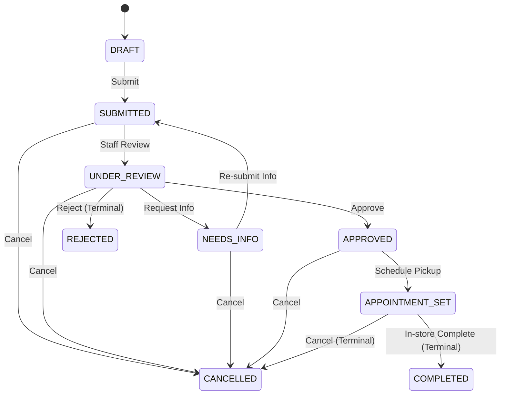

# MeePro Authoritative Business Rules

> **Target:** `/ai-docs/BUSINESS_RULES.md`  
> **Source:** Reverse-engineered and verified against actual code implementation (`src/features/applications/types.ts`, `src/lib/currency.ts`, `src/server/repositories/`).

---

## 1. Currency & Monetary Units [VERIFIED FROM CODE]

1. **Minor Currency Units (Satang)**:
   - All monetary values stored and calculated on the server MUST be integers in minor units (Satang, 100 Satang = 1 THB).
   - Example: ฿36,900.00 is stored as `3690000`.
   - Floating-point numbers are prohibited for financial balances and loan commitments.

2. **Installment Calculation Formula**:
   $$\text{MonthlyPaymentMinor} = \left\lfloor \frac{\text{LoanAmountMinor}}{\text{InstallmentMonths}} \right\rfloor$$
   - Remainder satangs are pinned to initial down payment or terminal installment to avoid fractional currency drift.

---

## 2. Installment Offers & Promotional Campaigns [DEVELOPMENT FIXTURE]

1. **Current Fixture Offer Structure**:
   - 3 Months: 0% interest (`ZERO_3M_V1`)
   - 6 Months: 0% interest (`ZERO_6M_V1`)
   - 10 Months: 0% interest (`ZERO_10M_V1`)
   - 12 Months: 0% interest (`PROMO_1111_12M` — scheduled future campaign)
   - 24 Months: 8.28% annual interest rate (`EXTENDED_24M_V1`)
   *(Note: This reflects current repository fixtures and development data, not an immutable business policy.)*

2. **Campaign Pre-Creation (Start & Expire Dates) [VERIFIED FROM CODE]**:
   - Offers support `effectiveFrom` (start date/time) and `effectiveUntil` (expiration date/time).
   - If `Date.now() < effectiveFrom`, the promotion status is computed as **`scheduled` (ตั้งเวลาล่วงหน้า)**.
   - If `Date.now() > effectiveUntil`, the promotion status transitions to **`expired` (หมดอายุแล้ว)**.
   - Active campaigns satisfy `effectiveFrom <= Date.now() <= effectiveUntil` and `isActive == true`.

---

## 3. Digital Financing Application Lifecycle [VERIFIED FROM CODE]

Authoritative status values and transition rules from `src/features/applications/types.ts`:

### Authoritative Application Statuses:
- `DRAFT`: Incomplete customer form
- `SUBMITTED`: Completed application submitted by customer
- `UNDER_REVIEW`: Staff actively reviewing applicant qualifications
- `NEEDS_INFO`: Additional documentation requested from customer
- `APPROVED`: Credit assessment approved
- `REJECTED`: Application rejected (terminal)
- `APPOINTMENT_SET`: In-store pickup appointment confirmed
- `COMPLETED`: In-store verification passed and contract completed (terminal)
- `CANCELLED`: Cancelled by customer or staff (terminal)

*(Note: `COLLECTED` is obsolete and replaced by `COMPLETED`.)*

### Valid State Transitions (`VALID_APPLICATION_TRANSITIONS`):



```typescript
export const VALID_APPLICATION_TRANSITIONS: Record<ApplicationStatus, ApplicationStatus[]> = {
  DRAFT: ['SUBMITTED'],
  SUBMITTED: ['UNDER_REVIEW', 'CANCELLED'],
  UNDER_REVIEW: ['NEEDS_INFO', 'APPROVED', 'REJECTED', 'CANCELLED'],
  NEEDS_INFO: ['SUBMITTED', 'CANCELLED'],
  APPROVED: ['APPOINTMENT_SET', 'CANCELLED'],
  APPOINTMENT_SET: ['COMPLETED', 'CANCELLED'],
  COMPLETED: [],
  REJECTED: [],
  CANCELLED: [],
};
```

1. **Idempotent Application Submission**:
   - Every submission requires an `idempotency_key`.
   - Repeated submissions with the same key return the existing record without generating duplicate credit applications.

2. **Branch Scoping & Data Privacy**:
   - `BRANCH_MANAGER` and `PC_STAFF` can only view and manage applications assigned to their designated `branch_id`.
   - Attempting to query foreign branch applications returns HTTP 403 Forbidden.

---

## 4. CMS & Storefront Customization Rules [VERIFIED FROM CODE]

1. **Backend-Only Customization**:
   - Frontend widget quick-manager modal was removed. Customization is restricted to authenticated CMS users in `/admin/page-builder`.

2. **Optimistic Concurrency & Revision Locking**:
   - Page updates require matching `expectedRevision`.
   - Concurrency conflicts return HTTP 409 Conflict with `REVISION_CONFLICT`.

3. **Media Reference Protection**:
   - Media deletion is blocked with HTTP 409 Conflict (`MEDIA_IN_USE`) if the asset is actively used in any published page widget.

4. **Membership & Rewards Toggle Rules**:
   - When `systemConfig.membershipEnabled == false`, tier badges (Gold/Silver) are suppressed across greeting widgets and account profile cards.
   - When `systemConfig.rewardsEnabled == false`, points balances and redemption boxes are hidden.
