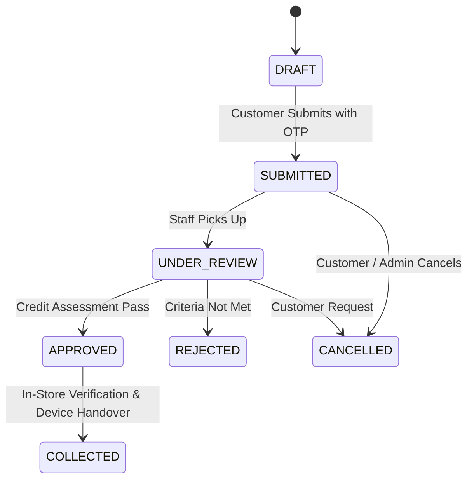

# MeePro Authoritative Business Rules

> **Target:** `/ai-docs/BUSINESS_RULES.md`  
> **Source:** Reverse-engineered and verified against authoritative production tests.

---

## 1. Currency & Monetary Units

1. **Minor Currency Units (Satang)**:
   - All monetary values stored and calculated on the server MUST be integers in minor units (Satang, 100 Satang = 1 THB).
   - Example: ฿36,900.00 is stored as `3690000`.
   - Never perform floating-point division on financial ledger totals.

2. **0% Installment Calculation Formula**:
   $$\text{MonthlyPaymentMinor} = \left\lfloor \frac{\text{LoanAmountMinor}}{\text{InstallmentMonths}} \right\rfloor$$
   - Remainder satangs are pinned to the initial down payment or final installment to guarantee zero fractional discrepancy.

---

## 2. Installment Offers & Promotional Campaigns

1. **Campaign Pre-Creation (Start & Expire Dates)**:
   - Administrators can pre-create promotional offers ahead of time using `effectiveFrom` (start date/time) and `effectiveUntil` (expiration date/time).
   - If `Date.now() < effectiveFrom`, the promotion is categorized as **`scheduled` (ตั้งเวลาล่วงหน้า)** and does not apply to regular public checkout until active.
   - If `Date.now() > effectiveUntil`, the promotion transitions automatically to **`expired` (หมดอายุแล้ว)**.
   - Active campaigns must satisfy `effectiveFrom <= Date.now() <= effectiveUntil` and `isActive == true`.

---

## 3. Digital Financing Application Lifecycle

1. **Idempotent Application Submission**:
   - Every submission must carry an `idempotency_key` (UUID/hash).
   - If a duplicate request arrives (e.g. user double-taps or network retries), the server returns the existing record without creating duplicate ledger loans or credit commitments.

2. **Branch Scoping & Data Privacy**:
   - A `BRANCH_MANAGER` or `SALES_ASSOCIATE` can only review applications assigned to their specific store branch (`branch_id`).
   - Cross-branch access is strictly blocked with HTTP 403 Forbidden.

---

## 4. CMS & Storefront Customization Rules

1. **Backend-Only Customization Enforcement**:
   - Visual page design, widget reordering, and theme styling are strictly restricted to authenticated administrators in `/admin/page-builder`.
   - No floating or inline customization modal is exposed on the public customer storefront.

2. **Optimistic Concurrency & Revision Locking**:
   - Saving a page draft requires providing `expectedRevision`.
   - If another editor modified the page concurrently, the server returns HTTP 409 Conflict with code `REVISION_CONFLICT` and current server revision number.

3. **Media Reference Protection**:
   - Media assets cannot be deleted if referenced in any active or published page widget.
   - Deletion attempt is rejected with HTTP 409 Conflict (`MEDIA_IN_USE`) listing referencing page IDs.

4. **Membership & Rewards Toggle Rules**:
   - When `systemConfig.membershipEnabled == false`, tier badges (Gold/Silver/VIP) are suppressed across customer greeting widgets and account profile cards.
   - When `systemConfig.rewardsEnabled == false`, MeePoints balances and point redemption boxes are hidden, reverting account overviews to single-column credit limits.
