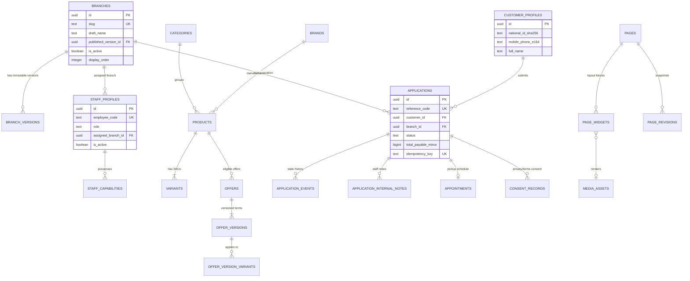

# MeePro Database Specification & Schema

> **Authoritative Sources:**  
> - `supabase/migrations/20260923213000_cms_v2_1_schema_and_rls.sql` [VERIFIED FROM MIGRATION]  
> - `supabase/migrations/20260924073909_authoritative_domain_v1.sql` [VERIFIED FROM MIGRATION]  
> **Target:** `/ai-docs/DATABASE.md`

---

## 1. Domain Relationship Overview

> ### ⚠️ SIMPLIFIED DOMAIN VIEW — NOT COMPLETE DATABASE SCHEMA
> *(The production database contains over 30 tables across media, branches, catalog, underwriting, CMS, audit logging, and authorization. This diagram illustrates the primary operational relationships.)*

---

## 2. Implemented Database Domains & Table Inventory [VERIFIED FROM MIGRATION]

From `supabase/migrations/20260924073909_authoritative_domain_v1.sql` and `20260923213000_cms_v2_1_schema_and_rls.sql`:

### A. Profiles & Security Domain
- `public.customer_profiles`: Customer personal record, normalized phone (`mobile_phone_e164`), and National ID hash.
- `public.staff_profiles`: Internal staff records linked to `auth.users(id)` with assigned `role` (`PC_STAFF`, `BRANCH_MANAGER`, `HQ`, `ADMIN`), `assigned_branch_id`, and `employee_code`.
- `public.staff_capabilities`: Granular authorization flags (e.g. `applications.review`, `catalog.manage`, `branches.publish`).

### B. Store & Branch Domain
- `public.branches`: Branch root entity with draft fields (`draft_name`, `draft_full_address`, `draft_google_maps_url`, `draft_opening_hours`), `published_version_id`, and `is_active`.
- `public.branch_versions`: Immutable published snapshots (`name`, `full_address`, `province`, `region`, `display_phone`, `normalized_phone`, `google_maps_url`, `published_at`).

### C. Catalog & Offer Domain
- `public.categories`: Device classifications (`smartphone`, `tablet`, `laptop`, `audio`, etc.).
- `public.brands`: Device manufacturers (`Apple`, `Samsung`, `Xiaomi`, etc.).
- `public.products`: Core device records (`slug`, `brand_id`, `category_id`, `summary`, `description`).
- `public.variants`: Device SKUs (`sku`, `product_id`, `storage_label`, `color_label`, `cash_price_minor`, `condition` (`new`/`used`)).
- `public.product_media`: Association between products/variants and `media_assets`.
- `public.branch_availability`: Per-branch stock inventory status (`in_stock`, `low_stock`, `out_of_stock`).
- `public.offers`: Installment campaign headers.
- `public.offer_versions`: Versioned financing terms (`down_payment_minor`, `installment_count`, `installment_amount_minor`, `fees_total_minor`, `total_payable_minor`, `valid_from`, `valid_until`).
- `public.offer_version_variants`: Many-to-many link binding specific offer versions to eligible device variants.
- Supporting catalog entities: `services`, `promotions`, `collections`, `collection_variants`, `articles`, `faqs`, `reviews`.

### D. Digital Financing Application Domain
- `public.applications`: Loan and installment requests (`reference_code`, `customer_id`, `branch_id`, `status`, `idempotency_key`, `total_payable_minor`).
  - Authoritative status values: `DRAFT`, `SUBMITTED`, `UNDER_REVIEW`, `NEEDS_INFO`, `APPROVED`, `REJECTED`, `APPOINTMENT_SET`, `COMPLETED`, `CANCELLED`.
- `public.application_events`: Immutable state audit trail tracking transitions, actors (`CUSTOMER`, `STAFF`, `SYSTEM`), and timestamps.
- `public.application_internal_notes`: Branch and underwriting staff notes.
- `public.appointments`: Scheduled in-store customer pickup appointments (`starts_at`, `status`).
- `public.appointment_change_requests`: Rescheduling requests from customer or staff.
- `public.consent_records`: Verifiable consent audit records for privacy policy, terms, and marketing.
- `public.notifications`: Applicant notification dispatches (SMS/in-app).

### E. CMS & Media Domain
- `public.pages`: Landing pages and storefront layouts (`slug`, `status`, `current_revision`).
- `public.page_widgets`: Widget blocks attached to pages with JSONB configs.
- `public.page_revisions`: Snapshot revisions for rollback.
- `public.media_assets`: Media library assets (`storage_path`, `public_url`, `mime_type`, `width`, `height`, `alt_text`, `visibility`).
- Supporting publication entities: `page_drafts`, `page_versions`, `site_settings`, `site_settings_versions`, `publish_jobs`, `audit_events`.

---

## 3. RLS Functions & Security Helpers [VERIFIED FROM MIGRATION]

The migration implements authoritative security functions:
1. `public.current_staff_user()`: Resolves authenticated caller to `staff_profiles` row.
2. `public.staff_has_capability(capability_name text)`: Validates whether the staff user possesses explicit permissions in `staff_capabilities`.
3. Branch-scoping RLS rules on `applications`:
   - Anonymous access: completely disabled.
   - Customer access: `auth.uid() = customer_id`.
   - Staff access: scoped to `assigned_branch_id` unless staff possesses global underwriting capability.
