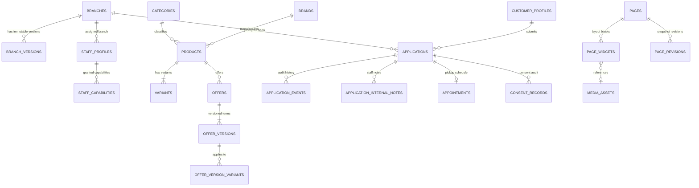

# MeePro Database Specification & Schema

> **Authoritative Sources:**  
> - `supabase/migrations/20260923213000_cms_v2_1_schema_and_rls.sql` [VERIFIED FROM MIGRATION]  
> - `supabase/migrations/20260924073909_authoritative_domain_v1.sql` [VERIFIED FROM MIGRATION]  
> **Target:** `/ai-docs/DATABASE.md`

---

## 1. Domain Relationship Overview

> ### ⚠️ SIMPLIFIED RELATIONSHIP VIEW — NOT COMPLETE DATABASE SCHEMA
> *(Relationships only; representative columns omitted to guarantee 100% adherence to authoritative migration definitions.)*

---

## 2. Implemented Database Domains & Table Inventory [VERIFIED FROM MIGRATION]

From `supabase/migrations/20260924073909_authoritative_domain_v1.sql` and `20260923213000_cms_v2_1_schema_and_rls.sql`:

### A. Profiles & Security Domain [VERIFIED FROM MIGRATION]
- `public.customer_profiles`:
  - `user_id` (uuid, primary key references `auth.users(id)` on delete cascade)
  - `normalized_phone` (text, not null unique check `normalized_phone ~ '^\+[1-9][0-9]{7,14}$'`)
  - `display_phone` (text, not null)
  - `contact_name` (text)
  - `status` (text, not null default `'active'` check `status in ('active', 'disabled')`)
  - `created_at` (timestamptz, not null default `now()`)
  - `updated_at` (timestamptz, not null default `now()`)
- `public.staff_profiles`:
  - `user_id` (uuid, primary key references `auth.users(id)` on delete cascade)
  - `display_name` (text, not null)
  - `role` (text, not null check `role in ('ADMIN', 'HQ', 'BRANCH_MANAGER', 'PC_STAFF')`)
  - `assigned_branch_id` (uuid references `public.branches(id)` on delete restrict)
  - `status` (text, not null default `'active'` check `status in ('active', 'disabled')`)
  - `created_at` (timestamptz, not null default `now()`)
  - `updated_at` (timestamptz, not null default `now()`)
  - Constraint: `role <> 'BRANCH_MANAGER' or assigned_branch_id is not null`
- `public.staff_capabilities`:
  - `staff_user_id` (uuid references `public.staff_profiles(user_id)` on delete cascade)
  - `capability` (text check `capability in ('APPLICATION_READ', 'APPLICATION_REVIEW', 'BRANCH_DRAFT_EDIT', 'CMS_DRAFT_EDIT', 'CMS_PREVIEW', 'CMS_PUBLISH', 'MEDIA_MANAGE', 'CATALOG_MANAGE', 'USER_MANAGE', 'AUDIT_READ')`)
  - `granted_by` (uuid references `auth.users(id)`)
  - `granted_at` (timestamptz default `now()`)
  - Primary Key: `(staff_user_id, capability)`

### B. Store & Branch Domain [VERIFIED FROM MIGRATION]
- `public.branches`:
  - `id` (uuid, primary key)
  - `slug` (text, unique check `slug ~ '^[a-z0-9]+(-[a-z0-9]+)*$'`)
  - `draft_name`, `draft_full_address`, `draft_province`, `draft_region`, `draft_display_phone`, `draft_normalized_phone`, `draft_google_maps_url`, `draft_image_asset_id`, `draft_image_alt`, `draft_opening_hours`, `draft_directions`, `draft_revision`
  - `published_version_id` (uuid)
  - `is_active` (boolean, default false)
  - `display_order` (integer, default 0)
  - `archived_at`, `created_by`, `updated_by`, `created_at`, `updated_at`
- `public.branch_versions`:
  - `id` (uuid, primary key)
  - `branch_id` (uuid references `public.branches(id)`)
  - `version_number` (bigint)
  - `name`, `full_address`, `province`, `region`, `display_phone`, `normalized_phone`, `google_maps_url`, `image_asset_id`, `image_alt`, `opening_hours`, `directions`
  - `published_by`, `published_at`

### C. Catalog & Offer Domain [VERIFIED FROM MIGRATION]
- `public.categories`: `id`, `slug`, `name`, `display_order`, `is_active`, `archived_at`
- `public.brands`: `id`, `slug`, `name`, `logo_asset_id`, `display_order`, `is_active`, `archived_at`
- `public.products`: `id`, `slug`, `brand_id`, `category_id`, `draft_title`, `draft_summary`, `draft_description`, `is_active`, `archived_at`
- `public.variants`: `id`, `product_id`, `sku`, `title`, `condition`, `storage`, `color_label`, `color_hex`, `cash_price_minor`, `is_active`
- `public.product_media`: `id`, `product_id`, `variant_id`, `media_asset_id`, `display_order`
- `public.branch_availability`: `id`, `variant_id`, `branch_id`, `status` (`in_stock`, `low_stock`, `out_of_stock`), `updated_at`
- `public.offers`: `id`, `slug`, `title`, `is_active`, `archived_at`
- `public.offer_versions`: `id`, `offer_id`, `version_number`, `down_payment_minor`, `installment_count`, `installment_amount_minor`, `fees_total_minor`, `total_payable_minor`, `valid_from`, `valid_until`, `terms`
- `public.offer_version_variants`: `offer_version_id`, `variant_id`
- Supporting entities: `public.services`, `public.promotions`, `public.collections`, `public.collection_variants`, `public.articles`, `public.faqs`, `public.reviews`

### D. Digital Financing Application Domain [VERIFIED FROM MIGRATION]
- `public.applications`:
  - `id` (uuid, primary key)
  - `reference_code` (text, unique)
  - `customer_id` (uuid references `public.customer_profiles(user_id)`)
  - `branch_id` (uuid references `public.branches(id)`)
  - `status` (text check `status in ('DRAFT', 'SUBMITTED', 'UNDER_REVIEW', 'NEEDS_INFO', 'APPROVED', 'REJECTED', 'APPOINTMENT_SET', 'COMPLETED', 'CANCELLED')`)
  - `idempotency_key` (text, unique)
  - `total_payable_minor`, `down_payment_minor`, `monthly_installment_minor`, `tenor_months`
- `public.application_events`: State audit records tracking transitions, actors (`CUSTOMER`, `STAFF`, `SYSTEM`), event types, and timestamps.
- `public.application_internal_notes`: Notes created by staff members on an application.
- `public.appointments`: In-store pickup scheduling records (`starts_at`, `status`).
- `public.appointment_change_requests`: Appointment reschedule requests.
- `public.consent_records`: Verifiable consent audit records for privacy policy, terms, and marketing.
- `public.notifications`: Applicant notification log records.

### E. CMS & Media Domain [VERIFIED FROM MIGRATION]
- `public.pages`: `id`, `slug`, `name`, `status`, `current_revision`, `published_version_id`, `published_at`
- `public.page_widgets`: `id`, `page_id`, `widget_type`, `sort_order`, `is_active`, `config`
- `public.page_revisions`: Snapshot revisions for rollback
- `public.media_assets`: `id`, `storage_path`, `public_url`, `mime_type`, `width`, `height`, `alt_text`, `visibility`
- Supporting publication entities: `public.page_drafts`, `public.page_versions`, `public.site_settings`, `public.site_settings_versions`, `public.publish_jobs`, `public.audit_events`

---

## 3. PostgreSQL Security Functions & RLS Helpers [VERIFIED FROM MIGRATION]

As defined in schema `private` in `supabase/migrations/20260924073909_authoritative_domain_v1.sql`:

1. **`private.current_staff_role()`**:
   Returns the current active role (`ADMIN`, `HQ`, `BRANCH_MANAGER`, `PC_STAFF`) for `auth.uid()` from `public.staff_profiles`.
2. **`private.is_staff()`**:
   Returns `boolean` confirming if `auth.uid()` exists in `public.staff_profiles` with `status = 'active'`.
3. **`private.is_hq_admin()`**:
   Returns `boolean` confirming if `private.current_staff_role()` is `'ADMIN'` or `'HQ'`.
4. **`private.has_staff_capability(requested_capability text)`**:
   Returns `boolean` confirming if the staff user possesses the requested capability in `public.staff_capabilities` or is HQ/Admin.
5. **`private.can_access_branch(requested_branch_id uuid)`**:
   Returns `boolean` validating whether `auth.uid()` can access data for the specified branch (HQ/Admin can access all branches; Branch Managers and PC Staff can only access their `assigned_branch_id`).
