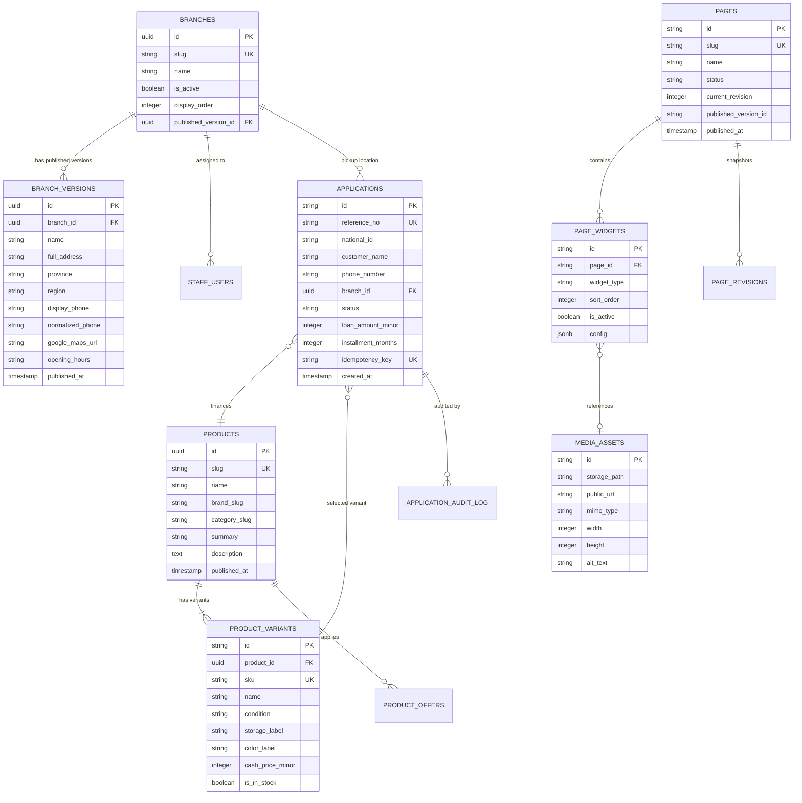

# MeePro Database Specification & Schema

> **Storage Engine:** PostgreSQL / Supabase  
> **Documentation Target:** `/ai-docs/DATABASE.md`

---

## 1. Entity-Relationship (ER) Diagram

---

## 2. Core Tables & Schemas

### A. Branches & Store Directory
- `branches`: Root entity representing a physical branch location.
  - `id` (UUID, PK)
  - `slug` (VARCHAR, Unique, Normalized lowercase alphanumeric)
  - `is_active` (BOOLEAN, Default: `true`)
  - `display_order` (INTEGER)
  - `published_version_id` (UUID, Foreign Key)
- `branch_versions`: Immutable audit snapshots of branch details to protect historical records.
  - `id` (UUID, PK)
  - `branch_id` (UUID, FK -> `branches.id`)
  - `name`, `full_address`, `province`, `region`
  - `display_phone` (e.g. `02-255-9001`)
  - `normalized_phone` (Thai E.164 format: `+6622559001`)
  - `google_maps_url` (HTTPS URL)
  - `opening_hours` (JSON array of strings)
  - `directions` (TEXT)

### B. CMS & Dynamic Page Builder
- `pages`: Landing pages and storefront layouts.
  - `id` (VARCHAR, PK)
  - `slug` (VARCHAR, Unique, e.g. `home`, `promotions`)
  - `name` (VARCHAR)
  - `status` (ENUM: `draft`, `published`, `archived`)
  - `current_revision` (INTEGER, Optimistic Concurrency Token)
  - `published_version_id` (VARCHAR)
- `page_widgets`: Modular content blocks attached to a page.
  - `id` (VARCHAR, PK)
  - `page_id` (VARCHAR, FK -> `pages.id`)
  - `widget_type` (ENUM: 30 supported types e.g. `HERO_BANNER`, `CUSTOMER_GREETING`, `PRODUCT_GRID`)
  - `sort_order` (INTEGER, Sequence)
  - `is_active` (BOOLEAN)
  - `config` (JSONB, Validated against Zod schema)
- `media_assets`: Image and media library.
  - `id` (VARCHAR, PK)
  - `storage_path` (VARCHAR, S3/Supabase Storage path)
  - `public_url` (VARCHAR)
  - `mime_type` (`image/jpeg`, `image/png`, `image/webp`, `image/svg+xml`, `video/mp4`)
  - `width` / `height` (INTEGER, Dimensions)
  - `alt_text` (TEXT)

### C. Financing Applications
- `applications`: Digital financing contracts submitted by customers.
  - `id` (VARCHAR, PK)
  - `reference_no` (VARCHAR, Unique, e.g. `APP-202609-XXXX`)
  - `idempotency_key` (VARCHAR, Unique, prevents duplicate requests)
  - `status` (`DRAFT`, `SUBMITTED`, `UNDER_REVIEW`, `APPROVED`, `REJECTED`, `COLLECTED`, `CANCELLED`)
  - `branch_id` (UUID, Pickup location)
  - `total_price_minor` / `down_payment_minor` / `monthly_payment_minor`
  - `installment_months` (INTEGER: 3, 6, 10, 12, 24)

---

## 3. Row-Level Security (RLS) Principles

1. **Customer Anonymity**: Public storefront read queries can only access `is_active = true` and `status = 'published'` records.
2. **Staff Authorization Scoping**: Branch Managers can only query applications assigned to their own `branch_id`.
3. **Admin Exclusivity**: Modifying system configuration, roles, and publishing revisions requires `SUPER_ADMIN` or `MANAGE_CMS` permissions.
